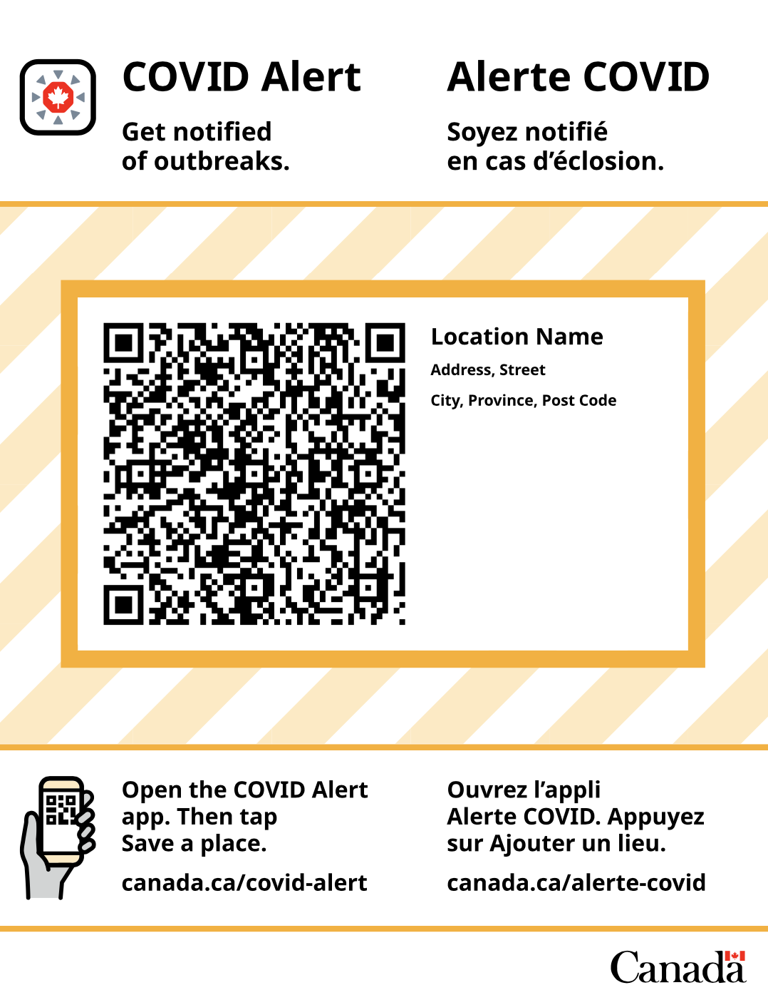
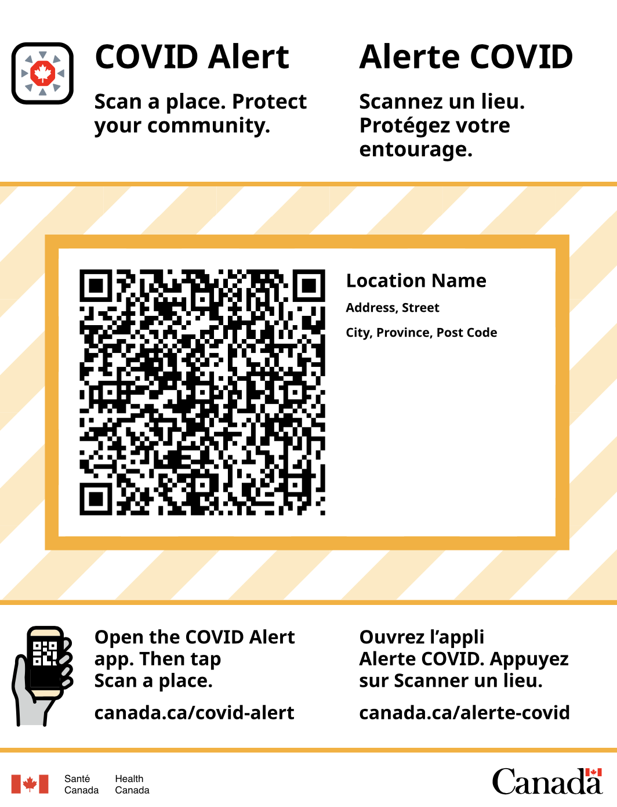
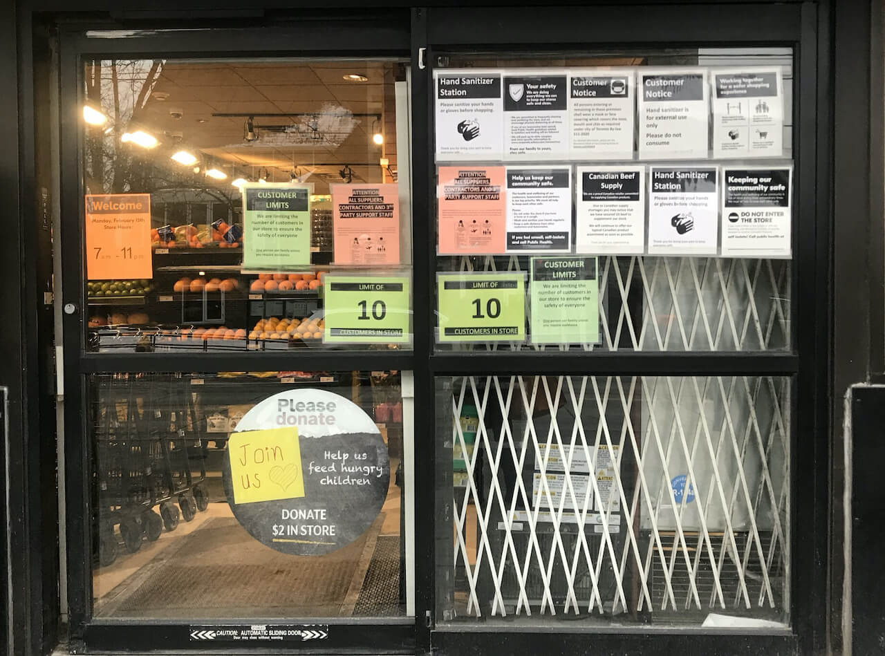
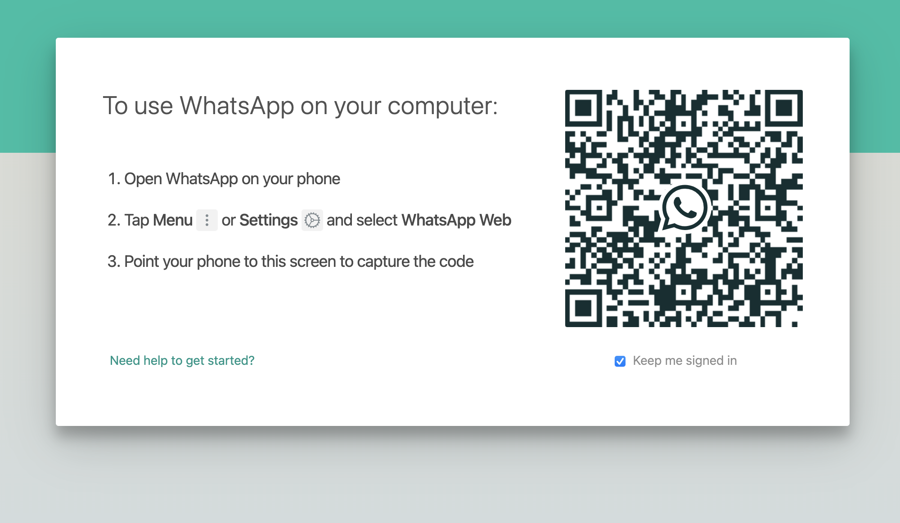

[Français](https://github.com/cds-snc/covid-alert-documentation/blob/main/recherche/RechercheConstatationsCodeQR.md)

# Findings from QR Code discovery research

Date: February 15, 2021 \
Author: Melissa Banyard

## Table of contents

*   [What we’ve learned from so far](#what-weve-learned-from-so-far)
*   [Mental Models for navigating safety while out](#mental-models-for-navigating-safety-while-out)
    *   [Recommendations, Set 1](#recommendations-set-1)
*   [What people need from Outbreak or Exposure notices](#what-people-need-from-outbreak-or-exposure-notices)
    *   [Recommendations, Set 2](#recommendations-set-2)
*   [Using, valuing, & accessing the QR code feature](#using-valuing--accessing-the-qr-code-feature)
    *   [Recommendations, Set 3](#recommendations-set-3)
*   [Feature-specific findings](#feature-specific-findings)
    *   [Accessibility Related Recommendations](#accessibility-related-recommendations)
    *   [Use in all weather conditions](#use-in-all-weather-conditions)
    *   [Recommendations, Set 4](#recommendations-set-4)

## What we’ve learned from so far:

*   Respondents’ main worries include: the health system being overloaded, impact on economy
*   Respondents’ 2nd main worries include: losing someone to COVID-19, or not seeing someone before they die
*   Respondents’ 3rd main worry is seeing a small business close
*   Likelihood of downloading the COVID Alert app remains fairly stable since mid-September
*   Awareness of the COVID Alert app has remained fairly stable since mid-October (80% are aware)
*   43% report that they are “tired” of avoid gathering with loved ones
*   40-45% report that they are “Not tired” of wearing masks, or physical distancing

We can assume that a significant amount of people are motivated to **prevent small businesses from closing, safely see their friends & family again,** and **continue using COVID Alert.**

### We collected insights from:

Ten participants from across Canada. Ages ranged from 20-30 to 70-80. All participants had been using COVID Alert. Participants were from a range of city, suburb, and rural areas. Several participants were low vision, blind, and/or immunocompromised.

### Research Questions

*   How do people currently move about, and protect themselves, in their communities during COVID-19?
*   What risks do people perceive in regards to interacting with, receiving info from, or aiding  contact tracing efforts?
*   Will the QR Code feature meet peoples’ needs? Why, why not?
*   Will it be accessible and usable to people? Why, why not?

**Method:** 10 Semi structured interviews (40 min), then concept evaluations w/ QR Code poster (20 min)

### The poster shared with participants:

<table>
  <tr>
   <td>

   </td>
   <td>

   </td>
  </tr>
  <tr>
   <td>V1, showed to first 5 participants
   </td>
   <td>V2, showed to last 5 participants
   </td>
  </tr>
</table>

## Mental Models for navigating safety while out

### Finding 1 — Safety measures in public places

The major factors that influence how safe people feel in a specific store are (1) safety measures that the store enforces, (2) store capacity & crowding, and (3) ventilation relative to size. 

To cope with these factors people (1) visit during off hours, (2) are hyper-aware of how close others are to them, and (3) avoid small or confined spaces altogether.

#### Example

> P1 “I have an alert mode going on. I watch how closely I go next to someone. Do I back up? Do I wait for someone else?” 

> P4 “I always go late at night when there are fewer people. But maybe there’s [more] risk because the aerosols are still in the air... But, it’s _so_ busy mid-day.”

### Finding 2 — Others following the rules

When out, people are often mindful of if others are following the rules. People expect stores to enforce rules like sanitizing and capacity limit. Some become frustrated with others who don’t follow the rules. Some will tell or ask others to follow rules, or they will leave altogether. 

Those in both rural and city settings describe mild frustration or confusion regarding others not abiding by masking, sanitizing, and social distancing rules.

#### Example

> P2 “People are getting really fed up with it and they don’t want to follow the rules but the longer they don’t follow the rules, the longer this lasts.”

> P8 “I will wear a mask and I _expect_ others to wear a mask, over their nose preferably (laughs)... Most stores have a sanitizing station at the front of the store. I expect that and will use it.”

### Finding 3 — Reading the rules when out

People describe reading rules very carefully at the beginning of the pandemic, and largely **not** paying attention to them _now_, but obeying general rules like masking, sanitizing and distancing. 

In general, people do not seem to read signage attentively as pandemic protocols have become routine, or the signage is inaccessible altogether. 

#### Example

> P4 “Originally I might have read the rules, but I don’t know.. Usually the rules are the same everywhere.”

> P6 (Blind) “My rules are probably better than [the store’s], I don’t bother even asking anymore… you have to be your own COVID Control person.”

### Finding 4 — Feeling inundated with number of rules and tasks

Some described a feeling of being inundated with tasks and rules when going to restaurants during the pandemic.

One person w/ low vision described frustration at the amount of signage on store fronts, and changing signage. 

#### Example

> P7 “With places that already have the QR code… I just… I’m concerned that some people might feel a bit inundated… you gotta do _all_ that before you sit down?”

> P10 (Blind) “ Walmart has 17 signs on the door. I have no idea which one is the COVID sign. I just hope for the best… I figure we’re all following mostly the same rules.”

#### A note on signage

<table>
  <tr>
   <td>

This is a storefront from my local grocer in Toronto.

Shoppers are asked to stand 5 - 10 feet away from the front door while lining up, and then hurry through to sanitize and grab a cart once it’s their turn.

How many of these COVID related signs are read?

   </td>
   <td>

   </td>
  </tr>
</table>

### Finding 5 — Sense of safety and region

People in rural areas tend to feel a sense of safety in their day to day. In interviews they described fatigue, but not frustration or fear to the degree that those in cities described.

#### Example

> P5 (rural area) “I’m not very worried… it’s not a very populated area. If I go to the bakery I might just see 3 - 4 other people.”

Versus: 

> P4 (urban area) “You don’t know what happens to the populations until a bunch of people have been vaccinated. If cases went down to almost 0 I would feel safer to go out.”

### Finding 6 — Concerns when leaving info at places

Some participants who had left contact information for contact tracing purposes at restaurants in the past had the following concerns:

*   Leaving their name in small communities where there is less anonymity & COVID is stigmatized.
*   Unsure how and when the venue would destroy the information.
*   Unsure of how the information would be stored.
*   A sense that the employees of the venue did not trust them.

#### Example

> P8 “If they were recording it electronically or just using paper records… I think it’s reasonable for them to keep it for a few weeks in terms of transmission but beyond that I don’t think they need to keep that forever… I want it to be used for public health reasons. Not for the restaurant to be calling me later or other purposes.”

### Recommendations, Set 1

*   The feature should not inundate visitors with several additional tasks 
*   The physical touch point in the store should not add to the noise of notices, but rather minimize it, or be easily findable.
*   People may need to be reminded to use the QR Code feature both in generally, and at specific sites, especially during the initial rollout of the feature.
*   At some point, the feature should clearly outline what is collected, where, and for how long.
*   The feature implementation should emphasize community, _over_ surveillance.
*   The value of the feature should be directly connected with increased safety.
*   The feature should emphasize anonymity as a value and a rule.

## What people need from Outbreak or Exposure notices

### Finding 7 — Tracking case counts in news

Half of the participants tracked case counts to gauge if restrictions might loosen or tighten in the near future, or to simply feel informed. 

Some participants felt that there wasn't enough publicly available information regarding outbreaks to truly know if certain areas were safe or not. Some felt that the descriptions of cases, or exact numbers were less reliable than at the beginning of the pandemic.

#### Example

> P7 “It’s kind of just trying to understand what the current trend is.. Are we up or down? Will this affect the current restrictions that we’re in? Are we going into lockdown soon? Will restrictions loosen?”

> P10 “Last June there was an employee at [store]  between 11 - 2 who had COVID, and they published that… but they _don’t_ tell you where and when anymore.”

### Finding 8 — Feeling fatigued by case counts and COVID news

The other half of participants described feeling fatigued and actively avoiding case count information in the news. This didn't seem to relate to their willingness to do things like mask, sanitize, and social distance 

Some participants describe a sense that nothing will change immediately, and so constant updates were avoided for their mental wellbeing.

#### Example

> P5 “I chose to voluntarily de-connect myself. It was heavy on my mental wellbeing. If I want to be connected, it’s no issue. But sometimes it is too much.”

> P4 “I think initially I was listening to it a lot more, but then I felt paranoid. I thought it better to not listen to it everyday. I stopped watching it after things got really worse. It’s not gonna help me.”

### Finding 9 — Needing more info about exposures / outbreaks

When people receive notice that they've been exposed to COVID-19 or an outbreak, they need more information so that they can determine the appropriate next steps in response to the perceived risk. 

They want to know:

*   How close they were to the COVID positive person
*   How they interacted with the COVID positive person (eg. were they wearing a mask?)
*   The time and date (eg. perhaps they were at a place before an outbreak occurred?)

#### Example

> P6 “Well I guess I would… want to know how recent [the outbreak] was relative to how recently I had been there.. Cause if there are any close [proximity] I might want to get tested.”

### Finding 10 — Outbreaks and entering places

People who are concerned about COVID risk (especially immunocompromised people who are independant) choose to visit stores based on some of the following perceptions:

*   **If there were outbreaks in those areas.** If there were in the past, people will still avoid those places in the long-term.
*   If they can fit multiple errands into one store or one visit (fewer trips)
*   If the store offers a way to prevent entering, like curbside pickup

#### Example

> P10 “I made choices in terms of where there were outbreaks. I don’t know how I feel about a certain store… what does it say about their cleaning practices? It made me think twice.”

> P4 “You don’t want to go somewhere where a bunch of employees might have it.”

### Recommendations, Set 2

*   When it comes to receiving outbreak notifications, set expectations upfront:
    *   Describe or list the type of information one should expect to receive before they get an outbreak notification.
    *   Consider providing people with options to receive more information by (eg.) calling someone to ask more questions, or a link to a webpage with more info on what to do. Or, consider providing people with next steps on how to protect themselves, self-isolate, or get tested.
    *   Consider what type of guidance may be needed to identify what next step is most appropriate. Eg. some people will be unsure if an outbreak notification means they are greatly at risk, or not. 
*   Consider how to connect messaging about this feature to a slowing or stopping of COVID-19, prevention of further spread, or a reopening of “normal life.”
*   Exercise caution on how tied to specific locations outbreak alerts are. These places become stigmatized, and may lose business in the long term. **Consider emphasizing next steps, over targeting locations. **

## Using, valuing, & accessing the QR code feature

### Finding 11 — QR Codes easy to use, hard to remember

2 participants have already used QR code features in New Zealand, the UK, and Canada. They both live in “lower risk” areas of Canada now. 

The participant from NZ described finding the NZ app very easy to use, but initially not something that was obvious for her friends and family to do. 

The participant from the UK & Canada described finding QR codes easy to find and clear about what to do upon arrival, but had concerns about how effective they might be for contact tracing / getting information about COVID-19. 

### Finding 12 — A sense of “already being tracked’

Several participants did not _perceive_ many risks related to the QR Code feature on COVID Alert since they were "already being tracked" either by their phone (“big brother”, other companies) or by the app itself.

#### Example

> P10 “If a contact tracer called me… the COVID App is supposed to know where I am anyways…”

> P2 “If you’re going around with a cell phone in your pocket ,on your purse, you’re being recorded all the time anyways.”

> P4 “I suppose if it does have a high tech thing it can take information from your phone. You don’t know these days what information companies have on you.”

### Finding 13 — Lawfulness and QR Codes

One participant described using the QR code feature as being “in” with fighting COVID. Another described it as being a “law abiding citizen with nothing to hide”.

#### Example

> P1 “Concerns? None really, as long as my phone is handy and juiced up. There are times when I have had it out and it runs out of battery juice… as long as its working [then] I would be game to participate… I think that’s the whole essence of this whole COVID-19 alert is either you are in or you are out. If you’re in you might as well go the whole hog.”

> P2 “Well I’ll put it this way, I am an honest law abiding system [and] I have nothing to hide. I’m not like all those protestors who are worried about the government taking control of us.”

### Finding 14 — Using phone while out

2 participants in their 50 - 60's described either not using their phone when they go out, or feeling burdened by asking to scan things while out. Both these participants had COVID Alert on their phone.

#### Example

> P1 “I ignore it while I’m out. I might check it at the end of the day when I get home. I’m that generation that didn’t grow up with cell phones. It’s also how I tend to interact with my cell phone… in fact sometimes I might forget it in the car

> P4 “I feel like you shouldnt have to worry about technology when you go out to eat… take my phone number and my name then just leave me alone.”

### Recommendations, Set 3

*   Consider how to decouple the location based data that this feature will collect, with GPS trackers, tracking apps, or other location based features already in use on peoples’ phones.
*   Consider how to strike a balance between framing this feature as a COVID safety precaution, without further exacerbating a sense of loss of control and freedom that many people are experiencing.
*   Consider providing COVID Alert users with a walk through of how to use their phone to scan QR Codes at locations. This walk through should minimize steps, to prevent a sense of task overload.
*   Consistently remind users of the feature both in-app, and in public venues.  

## Feature-specific findings

### Finding 15 — Accessibility of the QR Code poster

**For people who are blind and low vision:**

*   Blind / Low vision people risk missing the location of the sign if it is not placed in a consistent and easily accessible spot (eg. always on the door). 
*   Touching to read braille or find the sign is very unsanitary.
*   Notifications popping up during QR code scan are disruptive to screen readers. 
*   Scanning apps work better if multiple languages are sequestered to specific sides of page. 
*   The QR Code should be larger than normal, and consistently on the same spot on the page (like the very top, or very bottom, middle can be hard to locate depending on size). 

**For sighted people:**

*   Need to scan from distance if there are crowds or barriers. 
*   Need to know if QR Codes work through glass, dirty glass, harsh lighting conditions. 
*   Need to have indoor options in very cold environments, (phones die in the cold).

### Finding 16 — Interpreting the purpose of the QR Code poster, on site

Some participants said that scanning would tell them about their personal exposure to outbreaks. Some expected to receive outbreak information on the spot (real time). 

Several participants asked if the poster would indicate that the place they were visiting either _currently_ had an outbreak, or had had one recently. 

#### Example

> P5 “If I scan the Code QR, it will let me know if I was at a place that had an outbreak.”

> P4 “I guess because the QR is probably specific to the location each QR would have its own web page. Maybe an employee had a case… I’m sure it wouldn’t have any personal information on this.”

> P1 “If I were to see this poster does that mean that this has been the scene of a recent outbreak?”

### Finding 17 — Scanning the QR Code from phone camera

There is a strong inclination to scan from your phone camera or one’s QR Code reading app first. Not from COVID Alert, despite the phrase “Open COVID Alert app” at the bottom of the poster. 

#### Example

> P3 (blind) “Would the QR scanner be within the app? I would prefer to just use my QR Code scanning app. Maybe it would open the page, that would be easier… if people are already used to scanning a QR code then that process is already familiar. If you have to do it within the COVID-19 app, it’s just an extra step.”

> P4 “QR codes don’t work on my phone… they say just put your camera on it… maybe you have to download an app?”

#### A note on scanning QR’s

<table>
  <tr>
   <td>

Yesterday I wanted to log into WhatsApp on my laptop.

To automatically log in, I was given a QR Code to scan. When I saw the familiar symbol, I immediately opened my phone camera. I got an error message when I held it up to the QR Code.

When I looked at the instructions again, I realized I had looked at the QR Code before reading step 1, which was:  “Open WhatsApp on your phone”. 

Steps are easy to miss, especially if what we read first is the title and the QR Code. 

   </td>
   <td>

   </td>
  </tr>
</table>

### Finding 18 — Scanning the QR Code in general: 

People are used to QR codes getting them access to information, like menus, info-sites, maps, etc. 

Because of this, some assumed that QR Code would bring them to a government website, possibly with outbreak info or info on how to protect oneself. Some thought it might bring them to the restaurant’s menu, or store’s rules. They did not relate it to the COVID Alert app’s functionality or purpose, immediately. 

#### Example

> P1 “Well I mean… it has the quick code barcode kind of thing... I would position the phone in front of it and take a picture and it would send me to the correct website…”

> P2 “That is a scan… I don’t know what they’re called, but you scan it to get information on your phone.”

> P5 “I guess it would probably go to a website or web page.”

### Finding 19 — What information the QR Code collects

A few participants assumed that this did not record check out time, and simply just the time you arrived. Some seemed fine with this, as they felt they could easily assume how long the visit was based off of the location (eg. a restaurant would be 45 minutes on average). 

Others assumed the location would be stored, but were not confident if date and time would be as well. 

#### Example

> P8 “It would be saving that I scanned in and at what time, it doesn’t tell me how long I was in a place if I’m not scanning out… but I would know that.”

> P9 “If I use a QR code in this case to record where I’ve been, it needs to record enough information that I don’t have to think about it. It has to tell me that I was there on this date and this time…”

### Finding 20 — (Continued) What information the QR Code collects

A few participants assumed that this did not record check out time, and simply just the time you arrived. Some seemed fine with this, as they felt they could easily assume how long the visit was based off of the location (eg. a restaurant would be 45 minutes on average). 

Others assumed the location would be stored, but were not confident if date and time would be as well. 

Participants found it hard to understand what might be recorded or logged. Because of this they made assumptions regarding tracking. 

#### Example

> P8 “It would be saving that I scanned in and at what time, it doesn’t tell me how long I was in a place if I’m not scanning out… but I would know that.”

### Finding 21 — Where data is stored

A few participants raised concerns regarding where data was stored. Several assumed it was on a government server, and raised concerns that it could be hacked. 

#### Example

> P9 “Is this stored locally? Does it go to a database? I hope not… if it’s going to a government or centrally located database then I would be a bit worried. I don’t mind the government having my info but everyone gets hacked. I don’t want people getting credit cards in my name. How long is the data retained?”

> P7 “Maybe some of it is sent to a server.”

### Finding 22 — Accessing the list of places

Some participants mentioned a desire to interact with their list of places, outside of a contact tracing call. Other uses included:

*   Checking it and comparing it against news about increasing case counts or outbreaks. 
*   Adding to it manually if they forgot to scan a location, or could not scan

#### Example

> P7 “It might even be useful if as the user I could review back and see where I had been. For example if something were announced on the news… I could easily look back in the app to see if I have access to the history.”

### Accessibility Related Recommendations

*   Ensure signage is placed in a specific area on doors, walls, etc. _consistently_.
*   Consider stacking different languages, rather than placing them on either side of the page. Consider having separate French and English signs.  (to help with scanning apps for the blind).
*   QR Codes should be much larger than normal, and easily scannable from a distance. 
*   QR Codes should be consistently placed on the same area of the page. Consider, placing the QR code in the corner may allow blind x low vision people to better identify where it is on the paper.

### Use in all weather conditions: 

*   Consider encouraging venue managers to place QR Codes inside as well as outside
*   Consider providing guidance to laminate, or wipe clean any glass surrounding the QR Code 

### Recommendations, Set 4

*   Ensure the QR Code functionality is visible immediately within the app.
*   Consider how to emphasize using COVID Alert to scan the code as Step 1
*   As mentioned before, provide insight to users on what will happen after they scan a code.
*   As mentioned before, be very specific with the type of information that will be collected, and where and how that information will be stored.
*   In app, or elsewhere, consider emphasizing what the QR Code will NOT do, in order to prevent misuse or usage of malicious QR Codes. _eg. “The QR Code will not bring them to you to a new website, it will not lead to immediate information on the safety of the venue.”_
*   Consider describing how the information recorded may be useful for contact tracers.
*   Ensure the list of places is easily accessible for people in-app.
*   Consider offering options to modify, or add to the list of places.
