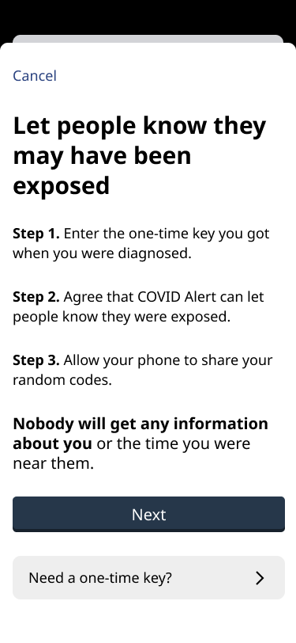
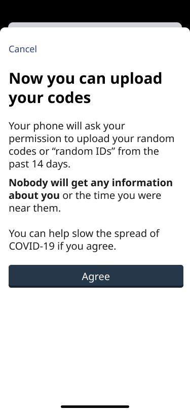
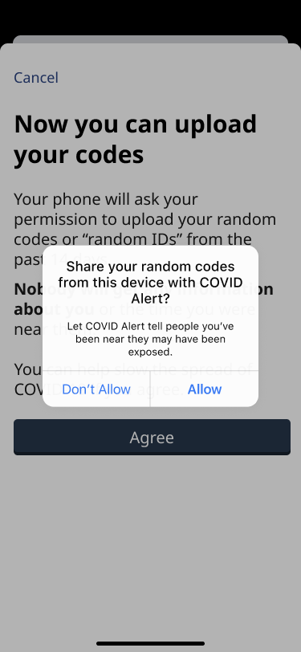
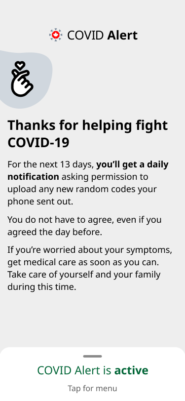
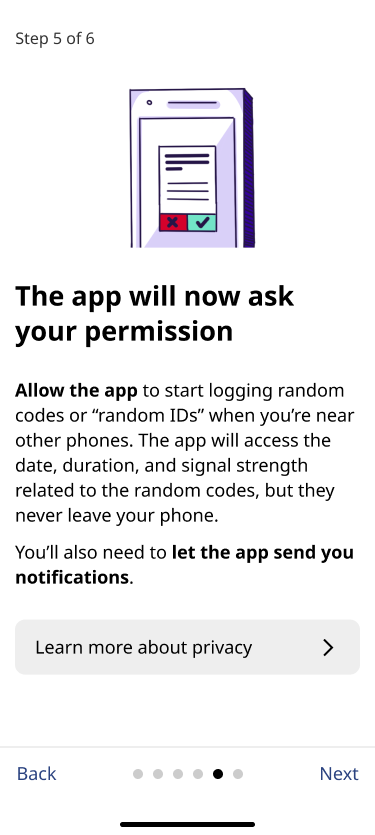
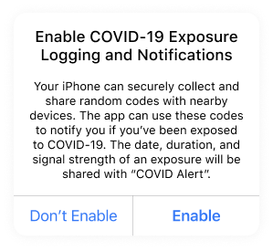
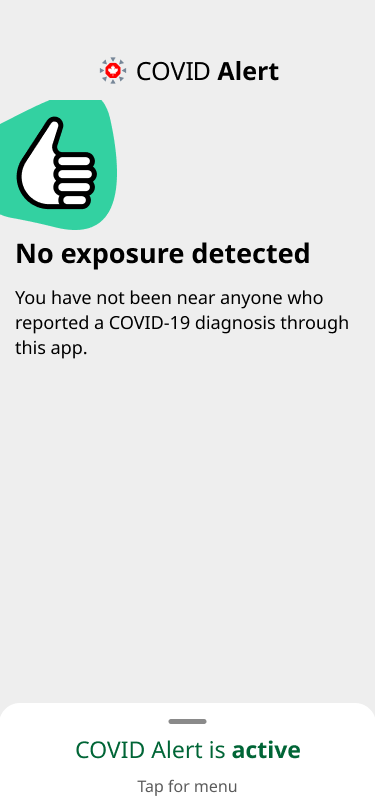
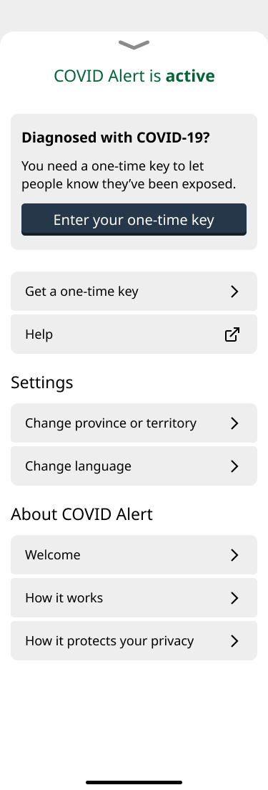

[Français](https://github.com/cds-snc/covid-alert-documentation/blob/main/recherche/UtilisabiliteAout2020.md)

# How well does the app support users when they receive a positive diagnosis (and one-time key)?

Date: Aug 25, 2020 \
Authors: Jeana Frost, Adrianne Lee

## Participants and context

9 people participated in a study of the one-time key handoff for COVID Alert: 5 English speakers and 4 French speakers. Testing was conducted in the week of August 14th, 2020. Most participants were early adopters of the technology and were following the news and efforts for the mobile app. They had the live app installed on their phones. One was a beta tester and a few downloaded it as soon as it was available. For the purposes of this study, participants used a Figma prototype that mimics some but not all of the interactivity of the live app. 

For the purpose of research, a colleague at CDS acted as a public health nurse and gave out the one-time keys.

## Highlight findings for the app:

*   Appreciated explanations but lots of layers of consent. The “Let people know they may have been exposed”, “Now you can upload your codes” screens and the “Share your random codes…” prompt seemed to be redundant for participants. 

    

    

*   Confusion between key and codes: (Paraphrasing) “I have entered only one code, why is it asking me to send all the codes?”
*   “Now you can upload your codes” suggests involvement from me.” As if the participant can upload them manually, one by one.
*   On the ‘Thank you’ screen, there was some concern and confusion about why they need to confirm sharing codes. Participants asked if they could confirm for the whole time at once.

*   Feelings of panic during the call might lead to a need to follow-up because participants indicated they might not be able to absorb information at the time of the call.

## What are the types of questions that participants had during the onboarding?

*   People progressed through most of the onboarding pages pretty quickly. For most this was because they had read them before. One person reported she does not read pages with a lot of text.
*   On Step 5 (“The app will now ask your permission”), things like understanding the concept of the ‘code’ slowed people down. 

	

*   For one participant, it wasn’t clear if Bluetooth had to be enabled for the app to work.
*   Two French-speaking participants did not understand “aléatoire”. One of the two participants spoke French as a second language.
*   Two people commented on the text in the ‘Enable Logging’ prompt, finding the font size small and the text long. 

## What made it difficult for participants to input the one-time key?

### From an interface perspective

Most people expressed a general comment that the interface is clear and interaction straightforward, but there were a few points for improvement.

*   “Tap for menu” label was not immediately clear for one person as a place to enter the code. Menu page has “a lot of things”, a lot of uses of the word “key”. One person thought he might click: “get a one time key” instead of “Enter your one-time key”.

	

	

*   A few people asked the person playing the role of nurse if they should enter their key in upper or lower case but the “nurse” told them either works. This is also a question that regional health authorities had during their regional onboarding onto the portal.
*   Appreciated explanations but there were lots of layers of consent. The “Let people know they may have been exposed”, “Now you can upload your codes” screens and the “Share your random codes…” prompt seemed to be redundant for participants. 
*   Confusion between keys and codes: (Paraphrasing) “I have entered only one code, why is it asking me to send all the codes?”
*   “Now you can upload your codes” suggests involvement from me.” As if the participant can upload them manually, one by one.
*   One person noted that “téléverser les codes” is easy to confuse with ‘one-time key’
*   The screenshots that the “nurse” was looking at didn’t exactly match what participants were looking at on the prototype and caused participants some confusion.
*   One person noted that others may have trouble switching from the phone app while they’re talking to the nurse, to the COVID Alert app, while trying to enter their key and may require additional instructions.
*   People understood the phonetic alphabet. One person was surprised it was not the standard one but understood the new system.

Limitation to study: Most people listened to instructions and didn’t read everything so it was not obvious if they would have problems or not on their own.

### From an emotional perspective

*   A few people imagined they would feel panic during such a call and that such emotions would get in the way of them following the instructions and absorbing information.
    *   One participant reflected on their previous experience receiving a diagnosis for another disease and how stressful that was, even with it being a non-communicable disease.
*   One person had gone through testing for COVID and said that it was a stressful experience and that she couldn’t take in information during such a call. Requested that the instructions be sent through a followup text.
*   The script the “nurse” used during the call was not a real script that healthcare workers use and was likely much shorter. Even so, it appeared to be quite a bit of information. One participant worried how she (and others) might remember the information given on the call.  

### From a practicality perspective

*   Some people said they don’t pick up the phone generally. They needed to see who it was on their phone to pick up. They worried they might miss the call.
*   There was a variety of ways people spoke to the person playing the role of the public health nurse
    *   Pick up the phone with one hand, writing down notes with the other. Switch to speaker to enter the key.
    *   Pick up the phone and hold it with her shoulder, note down the key. Switch to speaker phone.
    *   On bluetooth headphones the whole call - One participant was already using them for the session video call.
    *   On speaker phone the whole call - this is how they pick up all their calls
    *   Headphones - not something she would normally do, but prepared headphones because she knew she would be receiving a phone call.
*   The fact that participants were not able to hear the “nurse” and enter the code at the same time seemed to cause discomfort. People generally switched to speaker phones when the “nurse” asked whether they were ready to enter the key.
    *   It was good that the “nurse” asked if it was a good time. The speaker phone could present a privacy issue.
    *   Many seemed attentive to the “nurse” and tried to make sure they could talk and listen to the “nurse” at all times.
*   Some wrote the key down. They thought the “nurse” could prompt them to get paper and pen.
*   A couple of participants noted that people aren’t likely to read the screen except the headlines because they’re on the phone with someone. One participant didn’t read the instructions on the screens because the nurse on the phone was telling her the instructions.
*   Some people spontaneously repeated the key back to the nurse. On one phone call, the participant was not guided to the ‘Thank you’ screen.
*   During 2 of the sessions, there were breaks in the phone call connection. The breaks didn’t happen when the key was being read aloud, but it is a potential issue.

## What do participants suggest could help them better act on next steps?

*   A few people talked about the emotional state during the phone call and how it could affect the phone interaction.
    *   One person who went through testing for COVID and one other participant suggested for follow up with instructions by email or text.
    *   Participants wanted to be able to call back for answers to questions after they have time to think.
*   Three people expressed concern about confirming to share for 13 days.
    *   Participants thought people would lose interest and forget to confirm sharing each day, resulting in lost data. Some requested a blanket approval to share for all 13 days. This concern may have been due to the interface not being clear about why sharing for 13 days everyday instead of one ‘blanket’ upload was useful. One participant expected (from the onboarding screens) that he would share the 13 days in bulk. 
*   Need a reminder of how the notifications work.
    *   People noted that by the time they enter their key, it may be months after they have downloaded and onboarded onto the app. When they upload their codes, it may be a good opportunity to be reminded of the privacy implications of doing so. 
*   There were questions about next steps outside the app
    *   Participants asked if they would still need to inform their family and friends.

## App not meeting expectations

*   A couple of participants noted that they expected the app to be _the_ COVID-19 app, not just an app for alerting others.
    *   One if the participants expected to see a map of the situation across the country and updates on COVID. This request also came up in the beta testing.
    *   The other participant expected to be able to find diagnosis-related information after she had been diagnosed positive, such as health advice (including advice that she received during the simulated phone call and contact information of health professionals.) 
